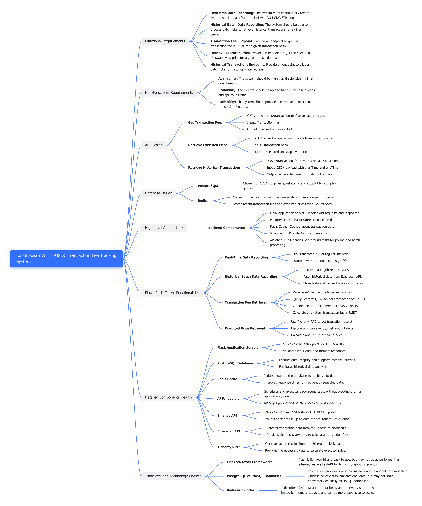

# Uniswap Transaction Fee Tracker

## Introduction

This project is a backend service designed to keep track of transaction fees in USDT for all Uniswap WETHUSDC Transactions. It supports real-time data recording and historical batch data recording. Using this service, users can query the transaction fee for any given transaction hash. The service leverages Ethereum blockchain data, specifically focusing on Uniswap V3 USDC/ETH pool transactions.

## Design mind-map



## Requirements

- Docker and `docker-compose` must be installed on the machine.
- Etherscan api key
- Alchemy RPC api key

## Installation Instructions

Follow these steps to get the project up and running:

### 1. Clone the Repository

```sh
git clone https://github.com/W-yk/uni-app.git
cd uni-app
```
### 2. Setup Environment Variables

The application requires certain environment variables(API KEYs) to run correctly. Follow the steps below:
1. Locate the `.env.example` file below /src.
2. Fill in ETHERSCAN_API_KEY,ALCHEMY_API_KEY after each '='
3. Change `.env.example` to `.env` 

To get etherscan api key, visit : [https://etherscan.io/myapikey]

To get Alchemy api key, visit : [https://dashboard.alchemy.com/] and set up a eth mainnet app.

### 3. Build, Test, and Run the Application

To ensure a seamless deployment and execution of our service, please adhere to the following detailed steps:

#### 1. **Building the containers**

Initiate the creation of the Docker containers with:

```sh
docker-compose build --no-cache
```

This command constructs the containers from scratch, guaranteeing that your environment is based on the latest configurations and dependencies specified within the Dockerfiles.

#### 2. **Executing the Test Suite**

To validate the integrity and functionality of the application, run the automated tests by executing:

```sh
docker-compose run --rm test
```

This command triggers the execution of the test suite located within the `/test` directory. Successful output resembles the following:

```
----------------------------------------------------------------------
Ran 8 tests in 4.753s

OK
```

A message indicating "OK" confirms that all tests have passed without any errors, implying that the application is behaving as expected.

#### 3. **Launching the Application**

To start the API service, use the command:

```sh
docker-compose up api
```

Append `-d` if you prefer running the application in detached mode, allowing it to operate in the background.

#### 4. **Stopping the Application**

When you need to halt the running services, the following command gracefully brings down the application and its associated containers:

```sh
docker-compose down
```

#### 5. **Purging the Database Volume**

To reset the database or clear accumulated data, you can clean up the existing database volume with:

```sh
docker volume prune
```

This action removes all unused volumes. Be cautious with this command as it will erase data volumes not attached to running containers, which might result in the loss of important data if not backed up appropriately.

## API Documentation

After starting the application, you can access the Swagger UI documentation at:

```
http://localhost:5000/api/docs
```

This page provides a detailed overview of the available endpoints and their specifications.

### Key Endpoints:

- **Get Transaction Fee**: Retrieves the transaction fee by hash.
    - `GET /api/transactions/transaction-fee/<transaction_hash>`

- **Retrieve Executed Price**: Gets the executed price of a transaction.
    - `GET /api/transactions/executed-price/<transaction_hash>`

- **Retrieve Historical Transactions**: Triggers a job to fetch and store historical transactions in a given time range.
    - `POST /api/transactions/retrieve-historical-transactions` 
    - Request Body: `{"startTime": "start_timestamp", "endTime": "end_timestamp"}`

## Architectural Principles and Design Considerations

The system is designed with modularity, scalability, and reliability in mind:

- **API Design**: RESTful principles are employed to ensure that the API is stateless, cacheable, and easy to use.
- **Database**: Chose PostgreSQL for its robustness, scalability, and support for complex queries.
- **Caching & Scalability**: Used redis to reduces load on the database by caching hot data, improved response times for frequently requested data.
- **Background Tasks**: Real-time data fetching and batch processing for historical data are handled by APScheduler, decoupling them from the API requests, thus improving API response times and system reliability.
